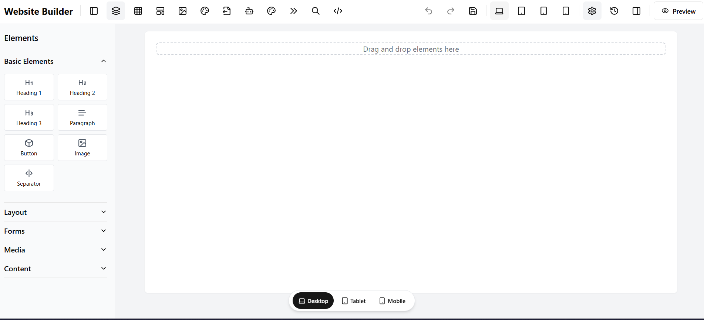
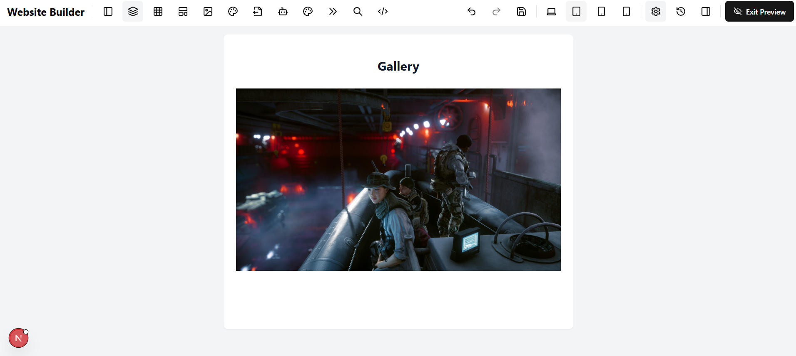
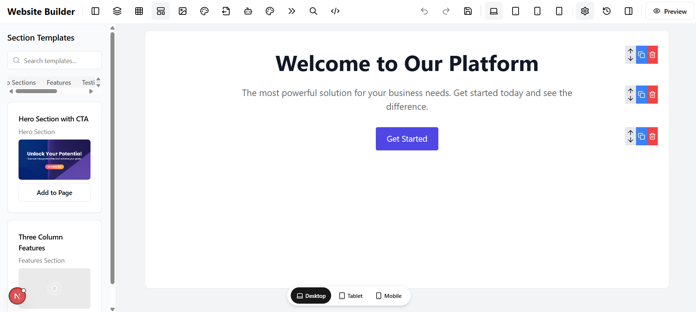

# Demo Website Builder

WebXbuilder is a powerful drag-and-drop website builder that lets you create responsive websites without coding. Inspired by nature's perfect design patterns, GeoBuilder provides an intuitive interface for building beautiful websites quickly and easily.

## ✨ Features

- **Intuitive Drag-and-Drop Interface**: Build websites by simply dragging and dropping elements onto your canvas
- **Responsive Design**: Create websites that look great on desktop, tablet, and mobile devices
- **Rich Element Library**: Access a wide range of elements including text, images, buttons, forms, and more
- **Real-time Preview**: See how your website looks as you build it
- **Animation System**: Add engaging animations to your website elements
- **SEO Tools**: Optimize your website for search engines
- **Custom Code Injection**: Add custom HTML, CSS, and JavaScript when needed
- **History Management**: Undo/redo changes with comprehensive history tracking
- **Local Storage Saving**: Automatically save your work to local storage

## 📸 Screenshots





## 🚀 Demo

Try the live demo: [webbuilder Demo](https://v0-drag-and-drop-prototype-lyart.vercel.app/)

## 🛠️ Installation

### Prerequisites

- Node.js 16.x or higher
- npm or yarn

### Setup

1. Clone the repository:
   ```
   git clone https://github.com/kingslayer458/Website-builder--in-progress.git

   ```

2. Install dependencies:
   ```
   npm install
   # or
   yarn install
   ```

3. Start the development server:
   ```
   npm run dev
   # or
   yarn dev
   ```

4. Open your browser and navigate to `http://localhost:3000`

## 📖 Usage Guide

### Getting Started

1. **Choose a template** or start from scratch
2. **Add elements** by dragging them from the sidebar onto the canvas
3. **Customize properties** using the properties panel on the right
4. **Preview** your website on different device sizes
5. **Save your work** using the save button or export when finished

### Key Shortcuts

- `Ctrl+Z` / `Cmd+Z`: Undo
- `Ctrl+Shift+Z` / `Cmd+Shift+Z`: Redo
- `Ctrl+S` / `Cmd+S`: Save

## 🔧 Technologies

- **Frontend Framework**: [Next.js](https://nextjs.org/)
- **UI Components**: [shadcn/ui](https://ui.shadcn.com/)
- **Styling**: [Tailwind CSS](https://tailwindcss.com/)
- **Drag and Drop**: [dnd kit](https://dndkit.com/)
- **Animation**: [Framer Motion](https://www.framer.com/motion/)
- **State Management**: React Hooks
- **Storage**: Local Storage API

## 📁 Project Structure

\`\`\`
geobuilder/
├── app/                  # Next.js app directory
│   ├── landing/          # Landing page route
│   ├── layout.tsx        # Root layout
│   └── page.tsx          # Main app page
├── components/           # React components
│   ├── ui/               # UI components (shadcn)
│   ├── canvas.tsx        # Main editing canvas
│   ├── element-renderer.tsx # Element rendering
│   ├── website-builder.tsx  # Main builder component
│   └── ...               # Other components
├── lib/                  # Utility functions and types
│   ├── element-utils.ts  # Element manipulation utilities
│   ├── template-utils.ts # Template utilities
│   ├── theme-utils.ts    # Theme utilities
│   ├── types.ts          # TypeScript type definitions
│   └── utils.ts          # General utilities
├── hooks/                # Custom React hooks
├── public/               # Static assets
└── ...
\`\`\`

## 👥 Contributing

Contributions are welcome! Please feel free to submit a Pull Request.

1. Fork the repository
2. Create your feature branch (`git checkout -b feature/amazing-feature`)
3. Commit your changes (`git commit -m 'Add some amazing feature'`)
4. Push to the branch (`git push origin feature/amazing-feature`)
5. Open a Pull Request

Please make sure your code follows the project's style guidelines and includes appropriate tests.

## 📄 License

This project is licensed under the MIT License - see the [LICENSE](LICENSE) file for details.

## 📞 Contact

Project Link: [https://github.com/kingslayer458/website_builder](https://github.com/kingslayer458/Website-builder--in-progress)

---

Made with ❤️ by [Your Name/Team]
